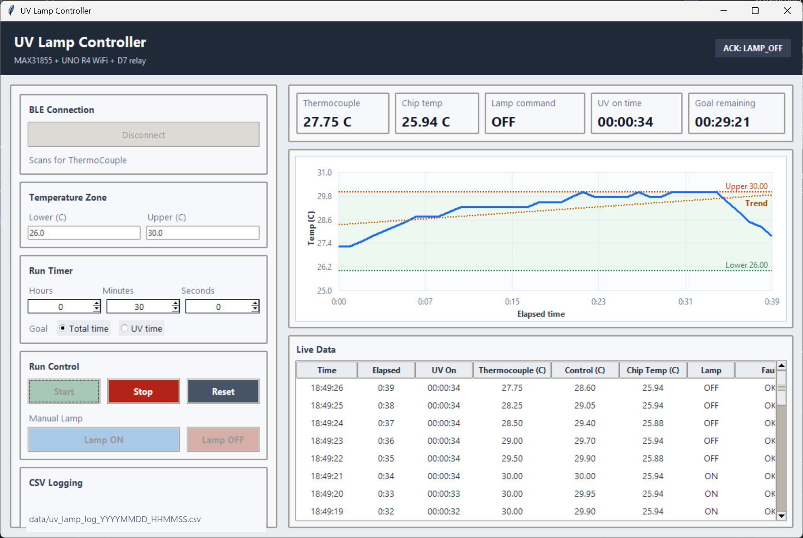

# UV Lamp Controller

Desktop BLE controller for a UV lamp with thermocouple feedback. The app
connects to a BLE device named `ThermoCouple`, plots live temperature, controls
the lamp within a lower/upper temperature band, and saves CSV logs to `data/`.

This repository contains the desktop controller only. It assumes the hardware
is already advertising the compatible BLE service below.



## Requirements

- Windows 10/11 or macOS with Bluetooth LE enabled
- Python 3.11 or newer
- A BLE peripheral advertising as `ThermoCouple`

On macOS, allow Bluetooth access for Terminal, your Python app, or your IDE if
prompted by System Settings.

## Install

Clone the repo:

```powershell
git clone https://github.com/itschendai/uv-lamp-controller.git
cd uv-lamp-controller
```

Create and activate a virtual environment.

Windows PowerShell:

```powershell
python -m venv .venv
.\.venv\Scripts\Activate.ps1
python -m pip install -r requirements.txt
```

macOS:

```bash
python3 -m venv .venv
source .venv/bin/activate
python -m pip install -r requirements.txt
```

## Run

Windows PowerShell:

```powershell
.\.venv\Scripts\python.exe uv_lamp_controller.py
```

macOS:

```bash
.venv/bin/python uv_lamp_controller.py
```

Click `Connect`, then use `Start` to begin temperature control and logging.
Each run creates `data/uv_lamp_log_YYYYMMDD_HHMMSS.csv`.

## GUI User Manual

1. Connect to the device

   Click `Connect` in the BLE Connection panel. The app scans for a BLE device
   named `ThermoCouple`. When connected, the button changes to `Disconnect`.

2. Set the temperature band

   Enter the lower and upper temperature limits in Celsius. During a run, the
   controller turns the lamp ON at or below the lower limit and OFF at or above
   the upper limit. The plot shades the active band and draws both limit lines.

3. Choose the run timer

   Set hours, minutes, and seconds. `Total time` counts wall-clock run time.
   `UV time` counts only while the lamp command is ON.

4. Start, stop, or reset a run

   `Start` begins a new run, clears the live table and plot, creates a CSV log,
   and enters warm-up control. `Stop` turns the lamp OFF and closes the active
   log. `Reset` clears the displayed data for the next run.

5. Use manual lamp control

   When connected and not running a recipe, `Lamp ON` and `Lamp OFF` send direct
   commands. Manual buttons are disabled during a run so automatic temperature
   control owns the lamp state.

6. Monitor live data

   The top metric cards show current thermocouple temperature, chip
   temperature, lamp command, UV-on time, and remaining goal time. The chart and
   table update from BLE notifications. CSV `elapsed_s` uses the device
   timestamp from each thermocouple sample, not PC receive time.

7. Find saved data

   Logs are saved under `data/` as `uv_lamp_log_YYYYMMDD_HHMMSS.csv`.

## BLE Contract

The app scans for either the local name `ThermoCouple` or this service UUID:

| Item | Value |
| --- | --- |
| Service UUID | `7f3fd100-9a7e-4f4f-a5f1-f6c5437fd801` |
| Data characteristic | `7f3fd101-9a7e-4f4f-a5f1-f6c5437fd801` (`READ`, `NOTIFY`) |
| Command characteristic | `7f3fd102-9a7e-4f4f-a5f1-f6c5437fd801` (`WRITE`) |

Data notifications use one line per sample:

```text
DATA,arduino_ms,thermocouple_C,internal_C,sensor_ok,fault_bits,raw,lamp
```

The app sends:

```text
LAMP_ON
LAMP_OFF
STATUS
```

`arduino_ms` should be captured when the thermocouple is read. The plot and CSV
`elapsed_s` use that device timestamp, so BLE notification delay does not shift
individual datapoints.
